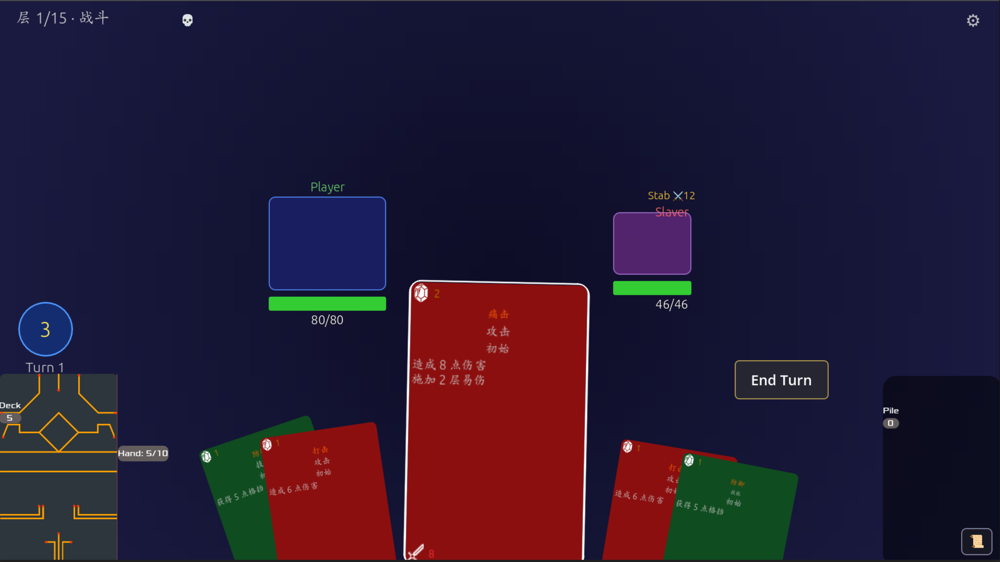

# My Card Game



一款受《杀戮尖塔》（Slay the Spire）启发的**单机 Roguelike 卡牌构筑游戏**，基于 [Godot Card Game Framework (CGF)](https://github.com/db0/godot-card-game-framework) 用 Godot 4 开发。

玩家从一套基础卡组出发，在程序化生成的 15 层地下城中逐层推进，通过回合制卡牌战斗击退普通敌人、精英与最终 Boss。每一次运行（Run）的地图、敌人、奖励都不相同——直到第 15 层击败 Boss 通关。

## 游戏特点

- 🗺️ **程序化 Roguelike 地图**：15 层分支路径，每局重新生成
- ⚔️ **回合制卡牌战斗**：能量、格挡、力量、中毒、易伤、虚弱、荆棘等完整状态系统
- 🃏 **16 张卡牌 × 可升级**：起手牌 + 奖励池，每张都能在篝火锻造升级
- 👹 **5 种敌人 + 双阶段 Boss**：普通 / 精英 / Boss 三档，Boss 血量过半切换招式
- 💎 **5 种遗物**：被动增益，贯穿整局策略
- 🏪 **商店与篝火**：花金币买卡 / 买遗物 / 治疗 / 移牌，或在篝火回血、锻造升级
- 📈 **动态难度**：敌人属性随层数线性递增

## 游戏循环

开始 Run → 随机获得 1 件起始遗物 → 进入地图 → 选择下一层节点 → 完成节点事件 → 回到地图 → … → 击败第 15 层 Boss → 通关

## 地图与节点

每局地图由 `MapGenerator` 程序化生成：共 15 层（floor 0–14），层与层之间按「最近邻 + 40% 概率连第二条边」的规则连成分支路径，每一步可在 1–2 个去向间选择。各层的节点类型由模板随机抽取，保证战斗/精英/商店/篝火的分布合理。

| 节点 | 图标 | 说明 |
|------|:----:|------|
| 战斗 (combat) | ⚔️ | 普通敌人战斗，胜利后获金币 + 3 选 1 卡牌奖励 |
| 精英 (elite) | 💀 | 强化敌人（血量/伤害 ×1.3），奖励更丰厚且必掉遗物 |
| 商店 (shop) | 💰 | 花金币买卡 / 买遗物 / 治疗 30% 最大 HP / 移除一张牌 |
| 篝火 (rest) | ❤️ | 休息回血，或锻造升级卡组中一张牌 |
| Boss | 👑 | 第 15 层固定 Boss（血量/伤害 ×1.5），双阶段 |

## 战斗系统

回合制，玩家回合与敌人回合交替循环，直至一方倒下。

- **能量**：每回合 3 点，出牌消耗，回合末清零
- **抽牌**：每回合抽 5 张；手牌、抽牌堆、弃牌堆循环，牌堆空时把弃牌堆洗回
- **出牌**：默认拖拽到敌人（`drag` 模式），也可切换为点击（`click` 模式）
- **格挡 (Block)**：吸收伤害，回合开始清零
- **敌人意图 (Intent)**：玩家回合期间显示敌人下回合将做什么（攻击 / 防御 / 增益），可据此规划

### 状态效果

| 状态 | 效果 |
|------|------|
| 力量 Strength | 每点使造成的攻击伤害 +1，永久 |
| 易伤 Vulnerable | 受到的伤害 ×1.5 |
| 虚弱 Weak | 造成的伤害 ×0.75 |
| 中毒 Poison | 回合开始受等量伤害并 -1 层，**无视格挡** |
| 荆棘 Thorns | 受到攻击时反弹伤害，回合开始清零 |

伤害结算顺序：基础伤害 + 力量 → 虚弱 ×0.75 → 易伤 ×1.5（向下取整，不为负）。

## 卡牌一览

起手牌组：5 × Strike + 4 × Defend + 1 × Bash。

| 卡牌 | 类型 | 费用 | 稀有度 | 效果 |
|------|------|:----:|--------|------|
| Strike 打击 | 攻击 | 1 | 起手 | 造成 6 伤害 |
| Defend 防御 | 技能 | 1 | 起手 | 获得 5 格挡 |
| Bash 痛击 | 攻击 | 2 | 起手 | 造成 8 伤害，施加 2 易伤 |
| Cleave 顺劈 | 攻击 | 1 | 普通 | 造成 8 伤害 |
| Iron Wave 铁浪 | 攻击 | 1 | 普通 | 造成 5 伤害，获得 5 格挡 |
| Shrug It Off 耸肩 | 技能 | 1 | 普通 | 获得 8 格挡，抽 1 牌 |
| Pommel Strike 柄击 | 攻击 | 1 | 普通 | 造成 9 伤害，抽 1 牌 |
| Poison Stab 毒刺 | 攻击 | 1 | 普通 | 造成 4 伤害，施加 3 中毒 |
| Crippling Blow 致残 | 攻击 | 2 | 普通 | 造成 9 伤害，施加 2 虚弱 |
| Inflame 激怒 | 能力 | 1 | 罕见 | 获得 2 力量（永久） |
| Bloodletting 放血 | 技能 | 0 | 罕见 | 失去 3 HP，获得 2 能量 |
| Bandage 绷带 | 技能 | 1 | 罕见 | 回复 6 HP |
| Thorns 荆棘 | 技能 | 1 | 罕见 | 获得 8 格挡，获得 3 荆棘 |
| Heavy Blow 重击 | 攻击 | 2 | 稀有 | 造成 14 伤害（受力量加成，且加成翻倍） |
| Shield Bash 盾击 | 攻击 | 2 | 稀有 | 造成等同当前格挡值的伤害 |
| Fiend Fire 魔火 | 攻击 | 2 | 稀有 | 造成 15 伤害，施加 2 中毒 |

所有卡牌均可在篝火**锻造升级**（名称加 `+` 后缀），伤害 / 格挡 / 附加效果相应增强（如 Strike+ 9 伤、Bash+ 10 伤+3 易伤、Inflame+ 3 力量）。

## 敌人

数据驱动，统一定义在 `enemies/EnemyDatabase.gd`。所有敌人不会连续两次使用同一招（`no_repeat`），且首回合固定出第一招。

| 敌人 | 类型 | 血量 | 招式 |
|------|------|:----:|------|
| Jaw Worm 颚虫 | 普通 | 42 | 咬 / 撕扯（伤+格挡）/ 咆哮（格挡+力量） |
| Fungi Beast 真菌兽 | 普通 | 28 | 咬 / 孢子云（中毒）/ 生长（格挡+力量） |
| Slaver 奴役者 | 普通 | 46 | 刺 / 耙（伤+虚弱）/ 防御（格挡） |
| Jaw Worm Elite 颚虫精英 | 精英 | 58 | 颚虫的强化形态 |
| **Heart Mimic 心脏模仿者** | **Boss** | 80 | **阶段一**（HP > 50%）：猛击 / 连击（伤+格挡）/ 回声（力量）；**血量 ≤50% 切换阶段二**：多段攻击 ×2 / 狂暴（伤+力量）/ 硬化（大格挡） |

敌人属性随层数递增：**每层 HP +8%、伤害 +5%**。

## 遗物

每局开局随机获得 1 件；击杀精英 / Boss、在商店购买也可获取。遗物效果持续整局。

| 遗物 | 图标 | 效果 |
|------|:----:|------|
| 橄榄石 Orichalcum | 💎 | 每回合开始获得 4 格挡 |
| 燃烧之刃 Burning Blade | 🔥 | 每回合首次攻击 +3 伤害 |
| 赤红之颅 Red Skull | 💀 | 击杀精英 / Boss 后永久 +2 力量 |
| 吸血之眼 Vampire Eye | 👁️ | 攻击造成伤害时回复 2 HP |
| 招财猫 Lucky Cat | 🐱 | 每场战斗额外 +15 金币 |

## 经济与成长

- **起始金币**：99
- **战斗金币奖励**：普通 20 + 层数×3；精英 40 + 层数×5；Boss 100（招财猫再 +15）
- **卡牌奖励**：每场战斗胜利后 3 选 1，可跳过
- **商店消费**：买卡（随机定价）、移除一张牌 75、治疗 30% 最大 HP 50、买遗物 150

## 技术栈

- **引擎**：Godot 4.6（GDScript）
- **框架**：[Godot Card Game Framework (CGF)](https://github.com/db0/godot-card-game-framework) —— 提供卡牌渲染、拖拽、手牌布局、抽/弃牌堆等基础能力
- **设计分辨率**：1920 × 1080，`canvas_items` 拉伸模式
- **测试**：GUT（Godot Unit Test）

### 项目结构（游戏自有代码 `src/custom/`）

```
src/custom/
├── MainMenu.gd / CGFMain.tscn        主菜单 / 游戏主场景入口
├── RunState.gd                       单次运行的全局状态（HP/金币/牌组/遗物/地图）
├── MapGenerator.gd                   15 层程序化地图生成
├── MapScreen.gd                      地图导航界面
├── CombatManager.gd                  战斗流程（回合/能量/抽弃牌/效果结算）
├── CombatEntity.gd                   战斗实体模型（HP/格挡/状态）
├── EnemyAI.gd                        数据驱动的敌人 AI（意图 / 多阶段）
├── enemies/EnemyDatabase.gd          敌人配置表
├── RelicDatabase.gd                  遗物配置表
├── cards/
│   ├── sets/SetDefinition_MyCardGame.gd   全部卡牌定义
│   ├── sets/SetScripts_MyCardGame.gd      卡牌脚本
│   └── CardConfig.gd                      卡牌全局配置
├── RewardScreen.gd                   战后奖励 / 3 选 1 卡牌
├── ShopScreen.gd                     商店
├── ForgeScreen.gd                    篝火锻造升级
├── CombatLog.gd                      战斗日志面板
└── AudioManager.gd                   音效管理
```

战斗系统**没有**沿用 CGF 自带的 ScriptingEngine，而是用更轻量的 `_effects` 数组（如 `["poison:3", "draw:1"]`）由 `CombatManager` 解析执行，以便精确控制 STS 风格的结算顺序（格挡 → 伤害 → 特殊效果），并方便叠加力量 / 易伤 / 虚弱等修正。

## 运行

1. 用 Godot 4.6+ 打开 `project.godot`
2. 主场景为 `res://src/custom/MainMenu.tscn`，直接运行即可
3. 主菜单可选：开始 Run / 牌组构筑器 / 卡牌图鉴 / GUT 测试

## 致谢

- 卡牌战斗框架基于 [db0/godot-card-game-framework](https://github.com/db0/godot-card-game-framework)
- 玩法设计灵感来自《Slay the Spire》

## 许可

AGPL-3.0（含 [ADDENDUM1](ADDENDUM1)，允许通过 Steam 分发并接入 Steamworks SDK）。
